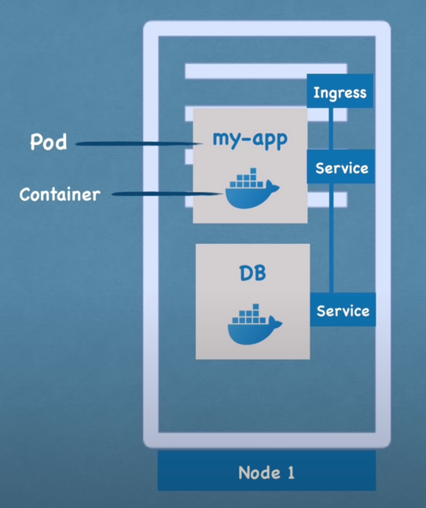
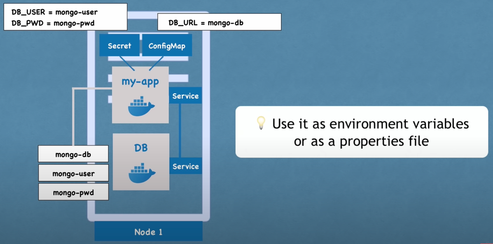
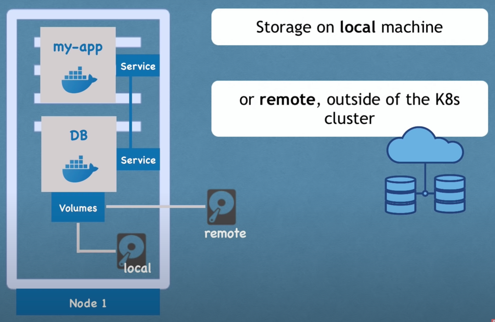
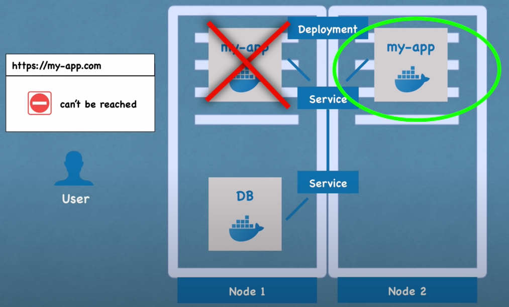
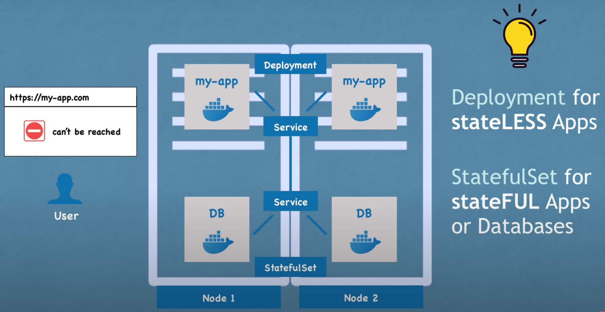

# Pods

- Smallest unit of Kubernetes
- 1 application per pods
- Example APP + DB
- Ephemeral => IP address to adjust every restart ? => Services
- External Services (for FRONT for example) VS Internal Services (for BACK for example to DB)
- Needs of custom domains instead of IP:Port => Ingress

# ConfigMap AND Secret

- Application configurations tedious if always deployment => ConfigMap
- ConfigMap contains application configurations (ENV variables / Property files for your applications)
  - ⚠️ No need to rebuild the pods
- For secures configurations => Secret

# Awareness on persistent Data

- K8s does not manage data persistence (if the DB pods died the data are lost)
- So need volumes

# Deployment

- Deployment is a layer of abstractions for Pods
- ReplicaSet => Manage replications (scale-up or scale-down)

- StatefulSet => DB cannot be replicated using `Deployment` like application because data inconsistency then
  - Or you can host it outside Kubernetes cluster because hard to manage replicas etc...

