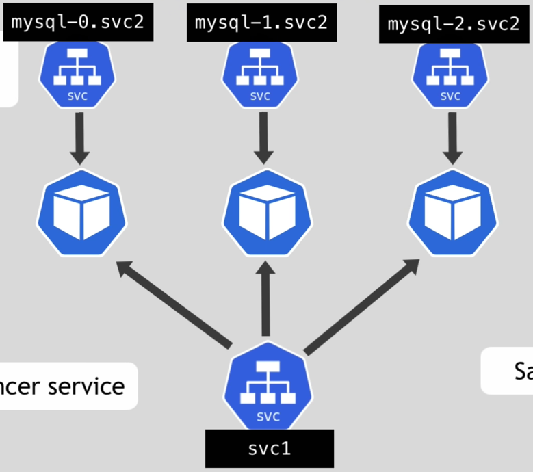

# StatefulSet on K8s global idea

- Mainly use for DBs (= for pods with stateful apps)
- Really similar to `Deployment` K8s resource
  - Replicas
  - Same pods `spec`

# StatefulSet

- `Pod` from `StatefulSet` replicas have identities with specific access and rules
  - Pods replicas have ordered identifier from `<n=0> (master)` to `<n+1> (worker)` (for `Deployment` is a random hash)
  - Only the `<StatefulSetName>-0` can read & write the others can read only

- They also have their own copy in different volume of the data
  - Each modification of the master volume replica is listened by the slaves
  - The modification is then re-done by all slaves
    - ⚠️ The synchronisation needs to be configured!
  - Each pods then should have the same state
  - If the number of replica is scale-up or scale-down it always begins from the last
    - scale-up = I copy from `<StatefulSetName>-<n-1>`
    - scale-down = I delete `<StatefulSetName>-<n>`
  - Remark: Possible to not used `PersistentVolumeClaim` to have the data synchronization only

- If a replica die then the new replica is reattached to the same volume to not lose state
  - Remark: If the master die then it will be replaced the new replica will also be a master
  - Identity + Data are preserved
- ⚠️ You have to provide a remote volume by yourself! (=> Local volume not possible to use on `StatefulSet`
because if the pod die it can be on another node)

- The container `<n+1>` will not finish starting (= wait) as long as `<n>` is not successfully running
- For the order of deletion in case of `kubectl delete -f <myYAMLStatefulSet>`
  - It does from last to `0`

- If using `Service` on `StatefulSet` each replicas will have a created personal `Service`
with the name `<podName>.<mainServiceName>`
  - This way if one replica die we can re-attach to the actual personal service
  - Because DNS endpoint stays the same

