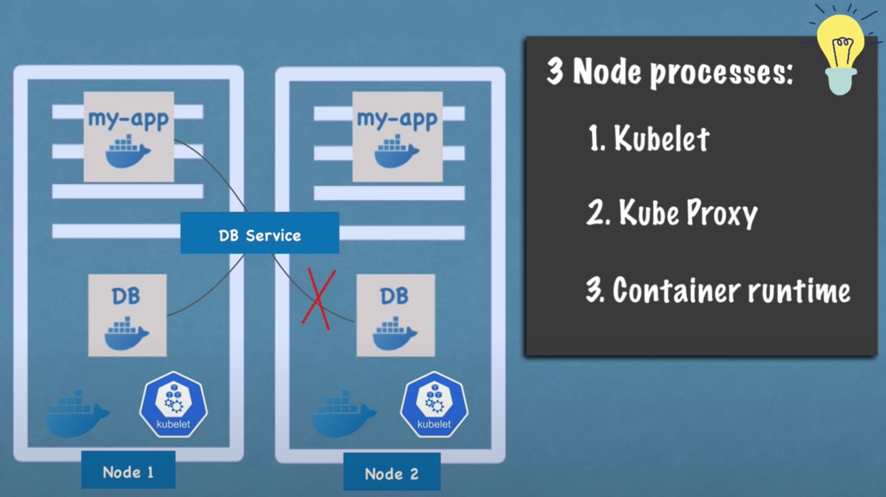
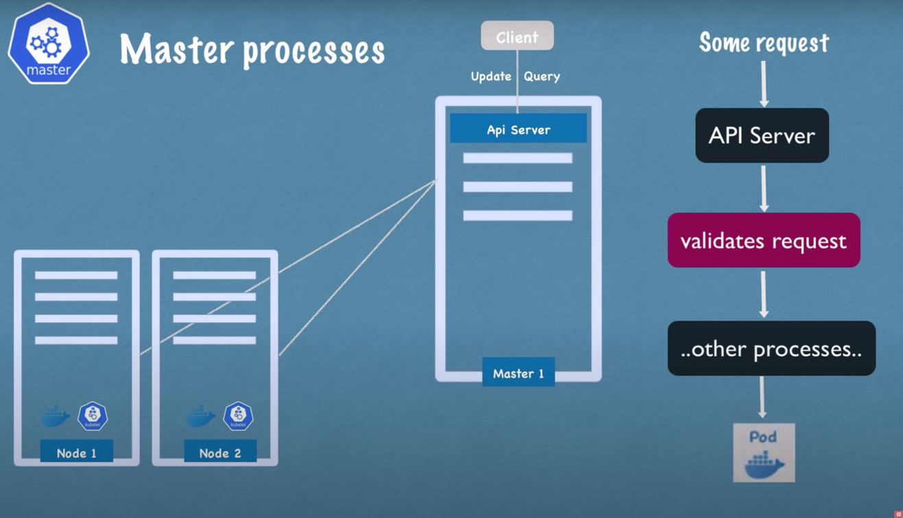
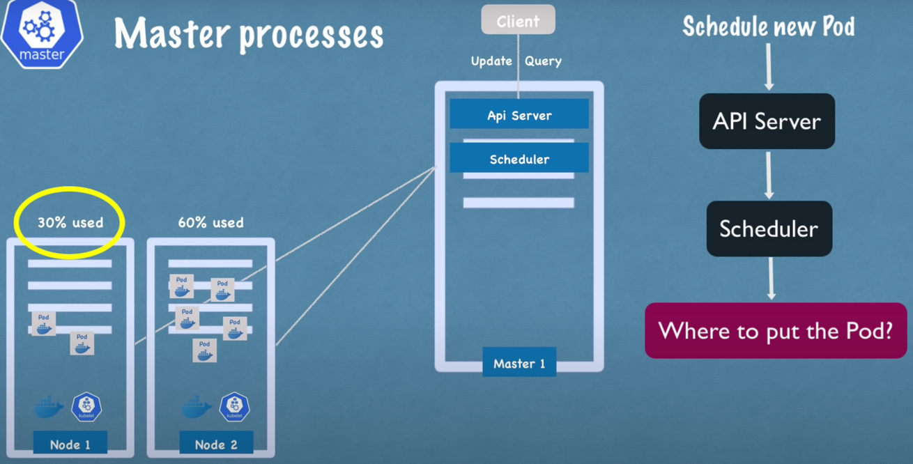
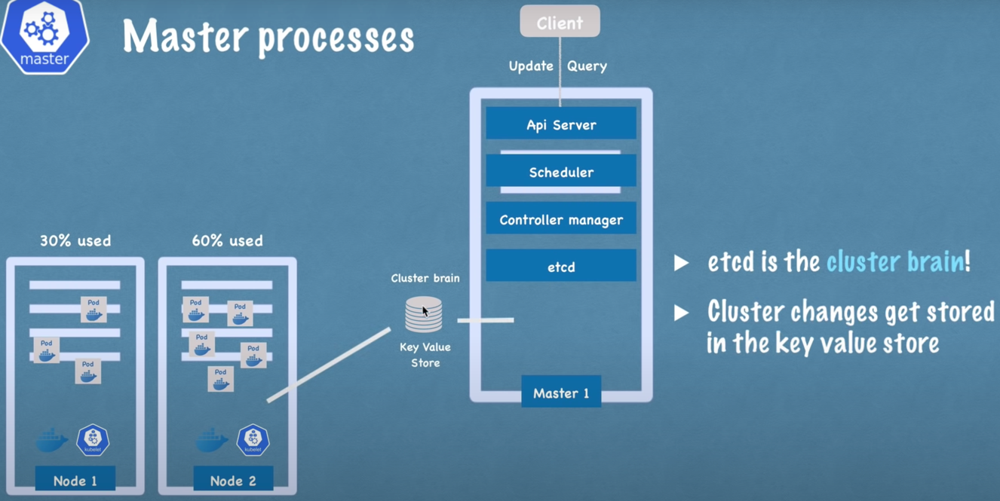
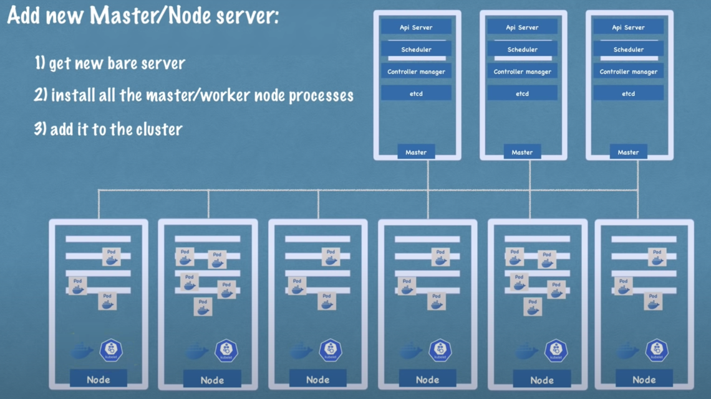

# Worker nodes process

- Kubelet => Starts pods + Coherence pods / containers
- Container runtime => For running containers
- Kube-proxy => Forward services request to pod in appropriate the node (ex: If DB replica in the same node => Forward here)

# Master node process

- API Server => Cluster gateway (Front door to interact with the Kubernetes cluster) + Gatekeeper (authentication)
  - kubectl command line
  - endpoint API request
  - Adding nodes
  - Deployment

- Scheduler => Process validated request
  - To which pod (CPU & RAM check)
  - On which node if pod creation (CPU & RAM check)
  - For that interaction with the kubelet

- Controller manager => Monitor / Recover pods states on nodes (respecting the Deployment)
    - For that interaction with the Scheduler

- etcd => Key-value store
  - How to know pods states ? Answer: etcd
  - What resources available for Scheduler ? Answer: etcd
  - Only application data are not stored (ex: DB)

- Master nodes are often replicated
  - API server load balanced
  - etcd replicated

# An example realistic

- Master nodes needs less resources (no applications running) than Worker nodes

 