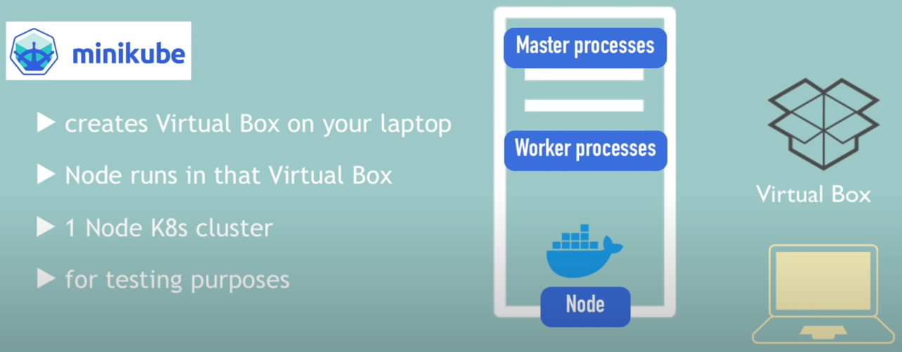
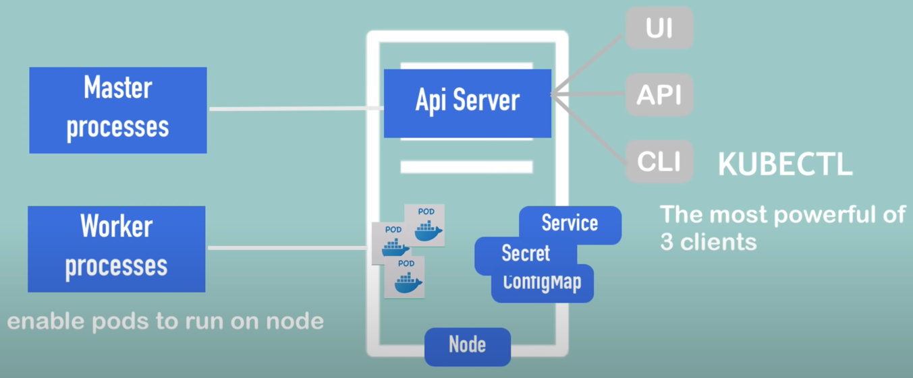

# Minikube

- Master node and Worker node on the same
- Docker will be pre-installed




# Kubectl

- In command line to interact with the cluster
- Can be minikube also cloud cluster




# Installation

- [link](https://minikube.sigs.k8s.io/docs/start/)

```shell
minikube start
minikube start --cpus 4 --memory 8192
kubectl get nodes
minikube status
kubectl version
```