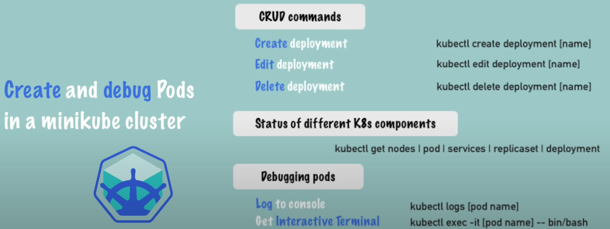
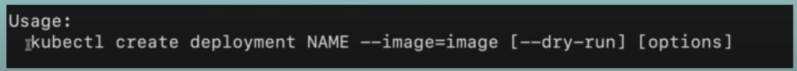

# Basic commands

- All main commands cheat sheet



- For help `-h`

```shell
kubectl create -h
```


# Create / Edit Deployment & Pods

- To create deployment with default blueprint



```shell
kubectl create deployment <depname> --image=nginx
kubectl get deployment
kubectl get pod
kubectl get replicaset
```

- To edit a deployment
  - It will auto recreate the pods with the good configuration

```shell
kubectl edit deployment <depname>
```


# Debugging

- An example for pod debug

```shell
kubectl create deployment <depname> --image=mongo
kubectl logs <podname>
kubectl describe pod <podname>
kubectl exec -it <podname> -- /bin/bash
```


# Deleting

- An example for pod deletion

```shell
kubectl delete deployment <depname>
kubectl get pod
kubectl get replicaset
```


# Deployment configuration file

- An example of nginx configuration deployment via [config file](config.yaml)
  - ⚠️ If run again but deployment spec changed => It will do an update

```yaml
apiVersion: apps/v1
kind: Deployment # <- A deployment
metadata:
  name: nginx-deploy # <- Deployment name
  labels:
    app: nginx
spec: # <- Spec for the deployment
  replicas: 1 # <- With 1 pod replica
  selector:
    matchLabels:
      app: nginx
  template: # <- Blueprint for the pod
    metadata:
      labels:
        app: nginx
    spec: # <- Spec for the pod
      containers:
        - name: nginx
          image: nginx:1.16 # <- With the image nginx:1.16
          ports:
            - containerPort: 80
```

```shell
kubectl apply -f <configfile>
kubectl delete -f <configfile>
```