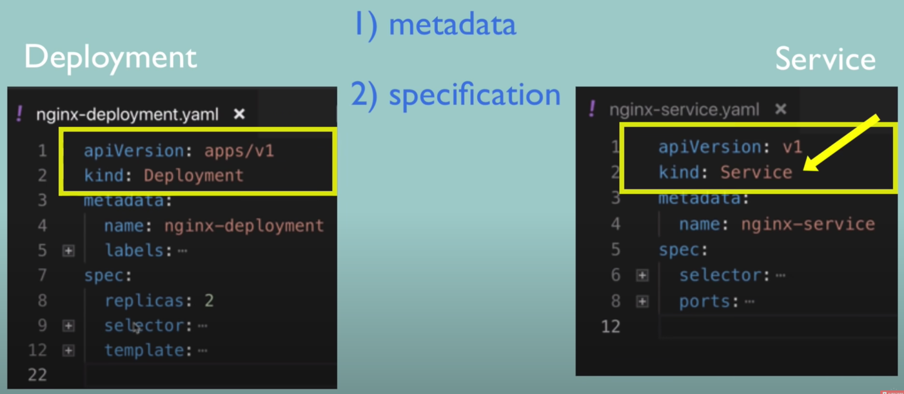
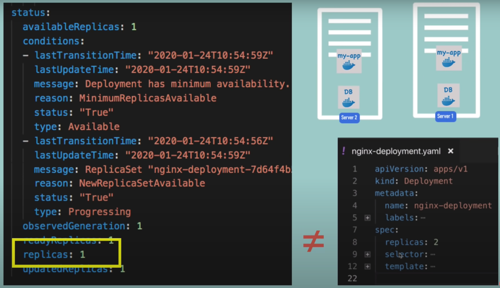
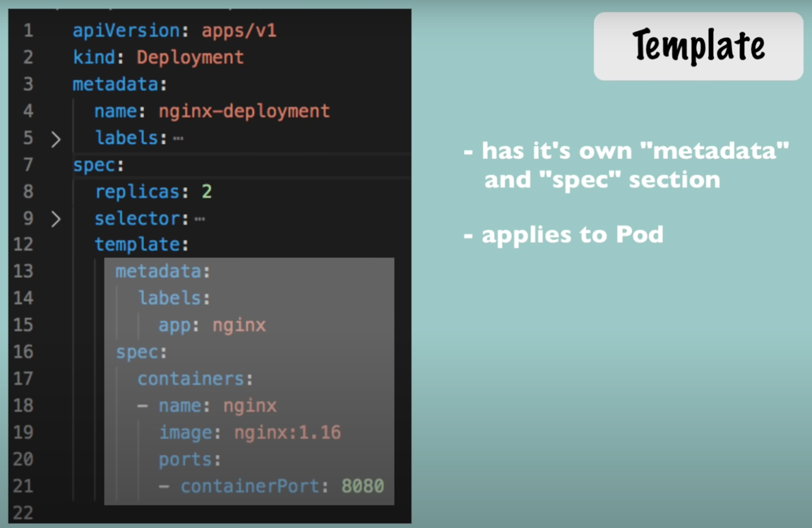
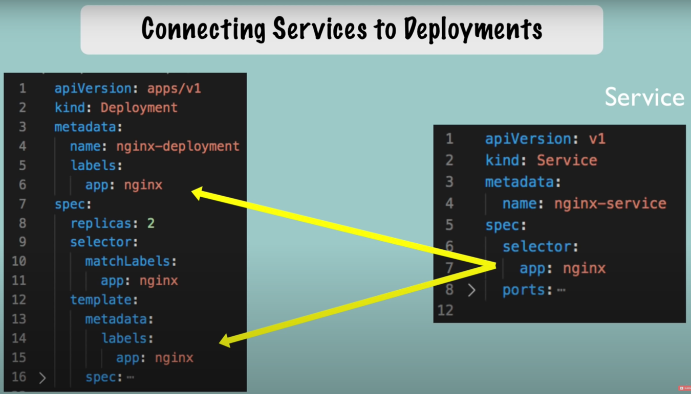
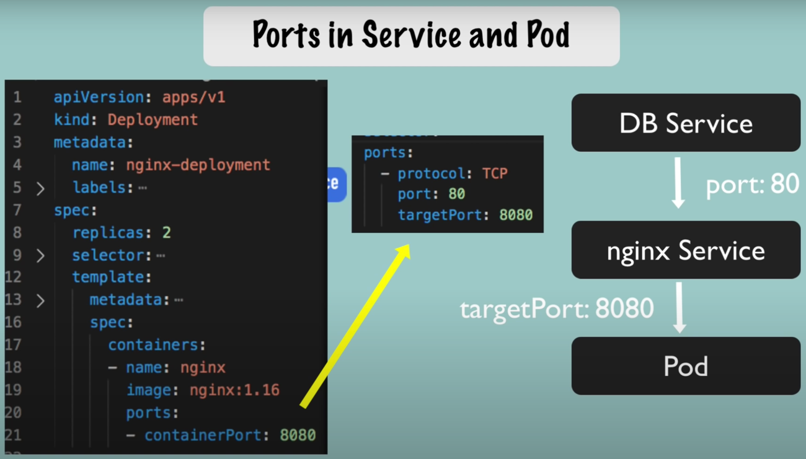
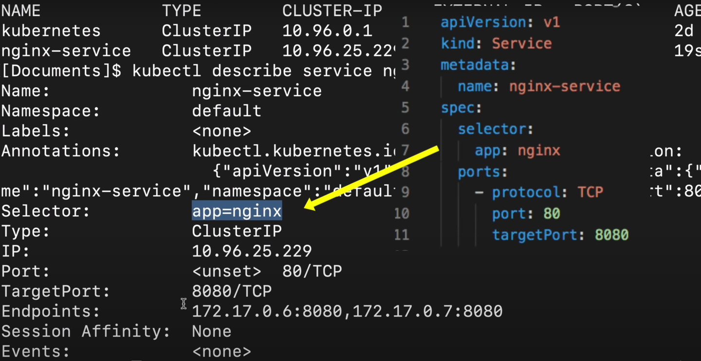
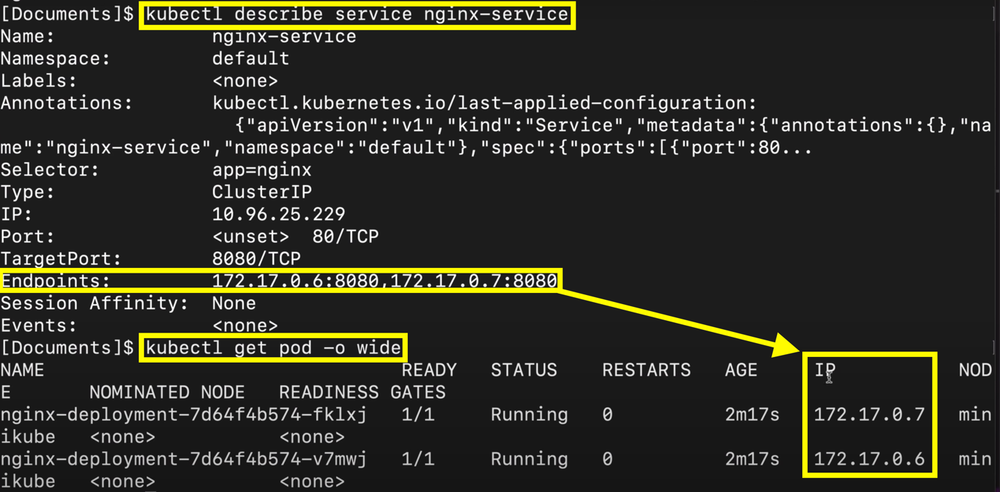

# Parts common to all

- Part0 `apiVersion` & `kind` => Kind of component and the api version used for creation
- Part1 `metadata` => Information identifying the created components (ex: name)
- Part2 `spec` => Specifications of the component
  - ⚠️ Specific to the `kind` !



- Part3 `status` => Automatically created and comes from `etcd`
  - ⚠️ If not equal to the spec it will try to reach the state ASAP !



- Strict indentation careful on this
  - [Online YAML validator](http://www.yamllint.com/)
- Good practice to store it with the application codes


# Pod & Service configuration

- Pod blueprint defined on `template`
  - Which image ?
  - Which port opens on ?
  - Container name ?



- Connection between `Deployment`, `Pods` and `Service`
  - In Deployment `metadata`, `labels` => Any key-value pair for ⚠️ linking deployment ⚠️ to the pod(s)
  - In Deployment `spec`, `selector` => Any key-value pair for ⚠️ linking pod(s) ⚠️ to the deployment and service(s)
  - In Service `spec`, `selector` => Any key-value pair for ⚠️ linking service ⚠️ to the pod(s)



- Beside labels ports also needs to be configured




# Example and commands

- For the deployment [the file](deployment.yaml)

```yaml
apiVersion: apps/v1
kind: Deployment
metadata:
  name: nginx-deploy
  labels: # <- ⚠️ To link the deployment to the pods
    app: nginx
spec:
  replicas: 2
  selector:
    matchLabels:
      app: nginx
  template:
    metadata:
      labels: # <- ⚠️ To link the pod(s) to the deployment or service(s)
        app: nginx
    spec:
      containers:
        - name: nginx
          image: nginx:1.16
          ports:
            - containerPort: 8080
```

- For the service [the file](service.yaml)

```yaml
apiVersion: v1
kind: Service
metadata:
  name: nginx-service
spec:
  selector:
    app: nginx # <- ⚠️ To link the service to the pod(s)
  ports:
    - protocol: TCP
      port: 80
      targetPort: 8080
```

- Commands for the demo

```shell
kubectl apply -f <configFile>
kubectl get service 
kubectl describe service <serviceName>
kubectl get pod -o wide
kubectl get deployment <deploymentName> -o yaml
kubectl delete -f <configFile>
```


