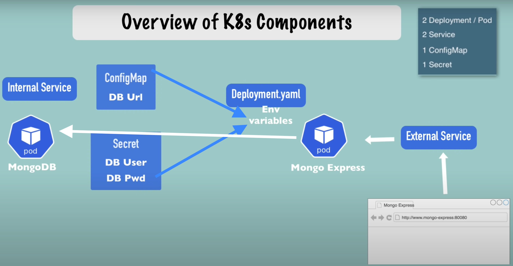

# Basic setup to build

- 0 -> Request from the browser
- 1 -> External service
- 2 -> Relaying to pod with Mongo Express (FRONT for MongoDB manipulation)
- 3 -> Relaying to the internal service
- 4 -> Action on the DB on another pods thanks to the information in `ConfigMap` & `Secret`




# Starting DB with secrets and service

- For Base64 encoding

```shell
echo -n <plainText> | base64
```

- Configuration files [deployment](mongodb-deployment.yaml) and [secret](mongodb-secret.yaml)

```yaml
apiVersion: v1
kind: Secret
metadata:
  name: mongodb-secret # <- Name for reference
type: Opaque # <- Means secret in key-value
data: # <- All the key-value pair stored here in Base64
  mongo-root-username: dXNlcm5hbWU= # <- "username"
  mongo-root-password: cGFzc3dvcmQ= # <- "password"
```

```yaml
apiVersion: apps/v1
kind: Deployment
metadata:
  name: mongo-dep
  labels:
    app: mongo-app
spec:
  replicas: 1
  selector:
    matchLabels:
      app: mongo-app
  template:
    metadata:
      labels:
        app: mongo-app
    spec:
      containers:
        - name: mongodb
          image: mongo:5.0.9
          ports:
            - containerPort: 27017
          env:
            - name: MONGO_INITDB_ROOT_USERNAME
              valueFrom:
                secretKeyRef:
                  name: mongodb-secret # <- reference to an already deployed secret
                  key: mongo-root-username
            - name: MONGO_INITDB_ROOT_PASSWORD
              valueFrom:
                secretKeyRef:
                  name: mongodb-secret # <- reference to an already deployed secret
                  key: mongo-root-password
```


- Commands used for both deployment above

```shell
kubectl get all
kubectl apply -f <configFile>
kubeclt get secret
kubectl describe pod <podName>
kubectl get pod --watch
```

- Creating the internal service for the DB

```yaml
<previousDeployment>
--- # <- On the same yaml file but separation for the service
apiVersion: v1
kind: Service
metadata:
  name: mongodb-service
spec:
  selector:
    app: mongo-app # <- The same label as for the pod
  ports:
    - protocol: TCP
      port: 27017 # <- Service port
      targetPort: 27017 # <- Container port
```

- Deploy and Check

```shell
kubectl apply -f <configFile>
kubectl get service
kubectl describe service
```