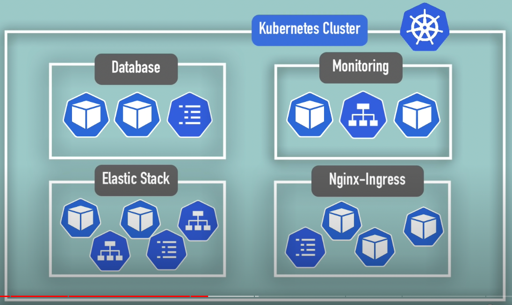
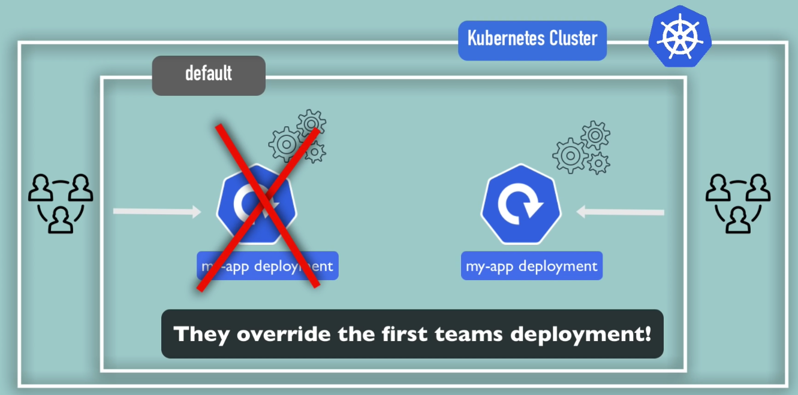
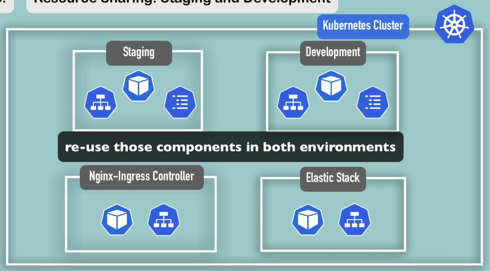
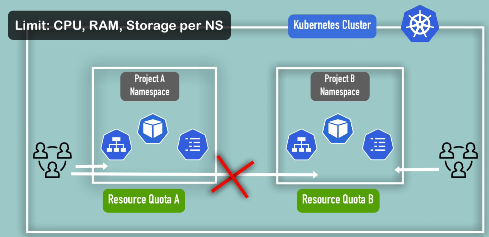
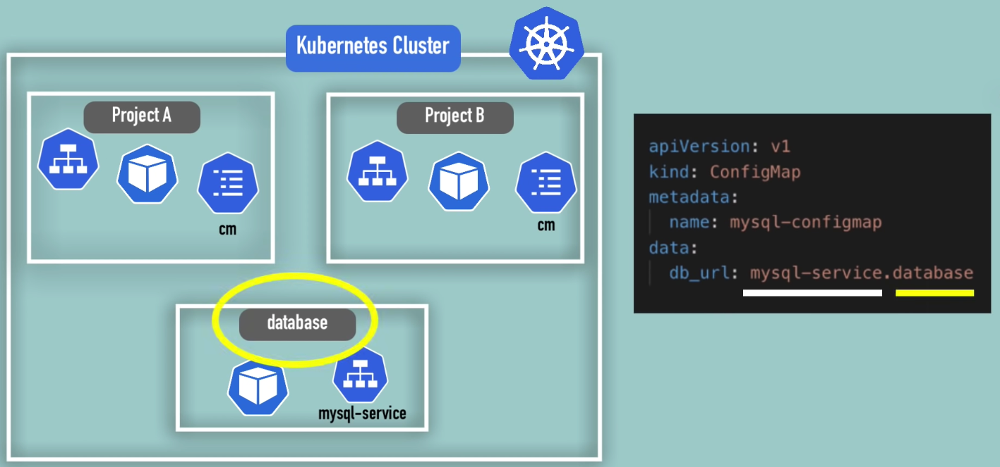

# General info

- Default namespaces already created

| Name                   | Description                                         |
|------------------------|-----------------------------------------------------|
| `kube-system`          | System, Master and Kubectl processes                |
| `kube-public`          | Cluster public information `kubectl cluster-info`   |
| `kube-node-lease`      | Node heartbeats info per node for node availability |
| `default`              | Default namespace for your users                    |
| `kubernetes-dashboard` | Only if using minikube and for `minikube dashboard` |

- 3 ways to create namespace 
  - Directly creating it through command `kubectl create namespace <my-namespace>`
  - Possible also via configuration file if you have the Role & put `namespace: <a-non-existing-namespace>`
  - Or via kubectl `kubectl apply -f <my-manifest-file> --namespace=my-namespace`

- Command to list / switch between namespaces
  - `kubens`
  - `kubens <my-namespace-name>`

# When using different namespaces

- Organizing k8s resources according business types

- Per team because of names conflict

- Per environment (OR blue-green prod deployment when full prod)

- Resource quotas

# Namespace"d" resources or not

- `ConfigMap`, `Secret`, `Role` and `RoleBinding` are namespace"d"
  - It means they cannot be used between namespaces

- A service can be used between namespaces

- `Volumne` and `Node` are not namespace"d"

- To list all resources according if namespace"d" or not
  - `kubectl api-resources --namespaced=false`
  - `kubectl api-resources --namespaced=true`