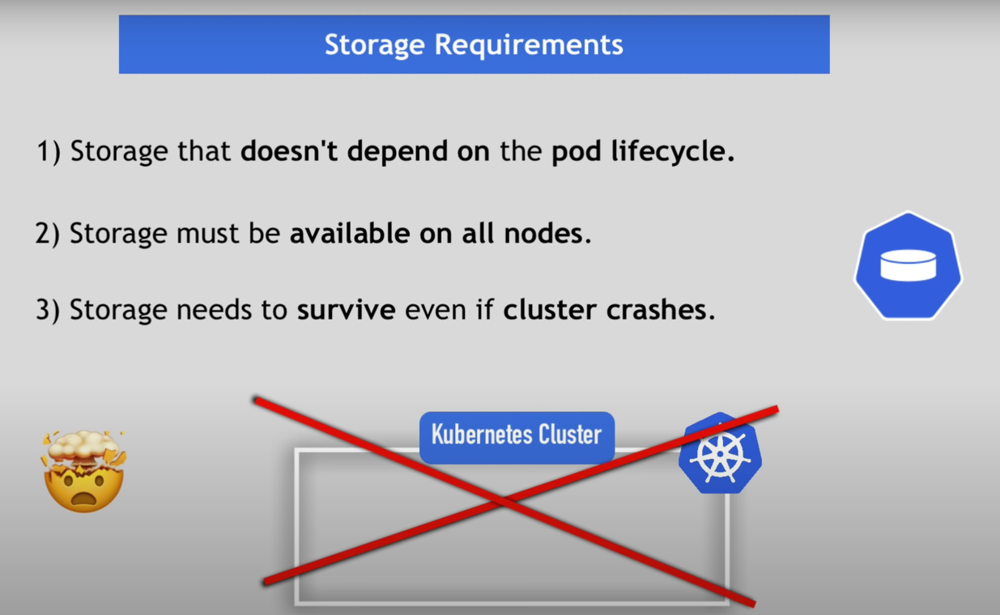
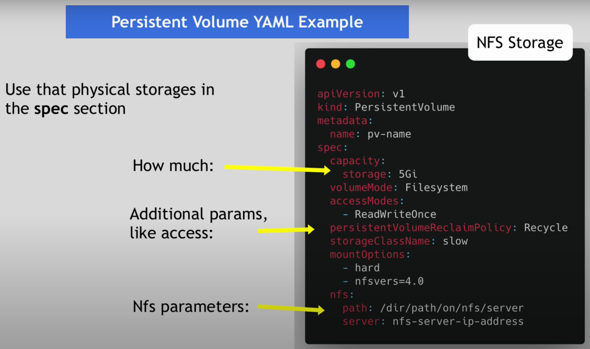
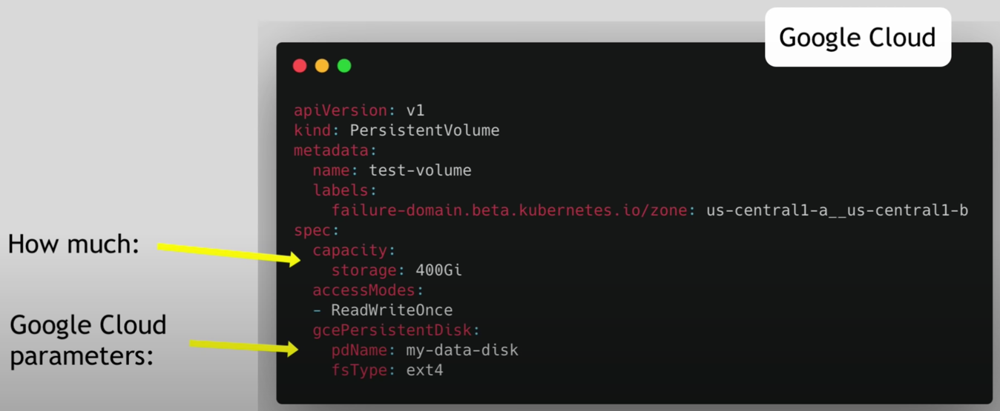
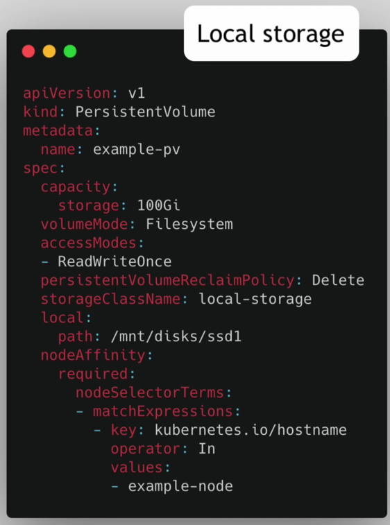
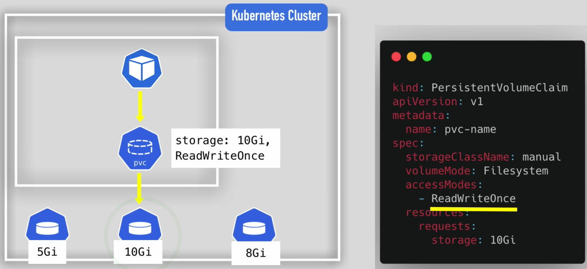
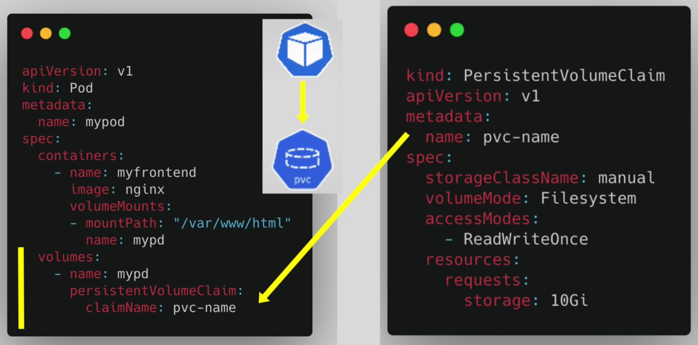
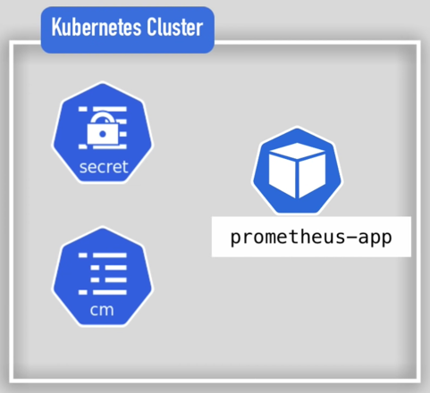
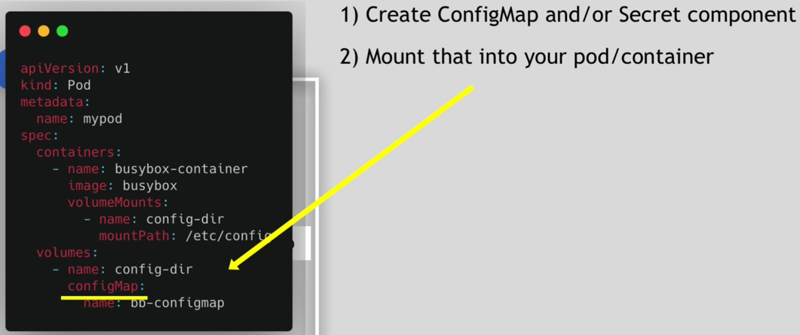
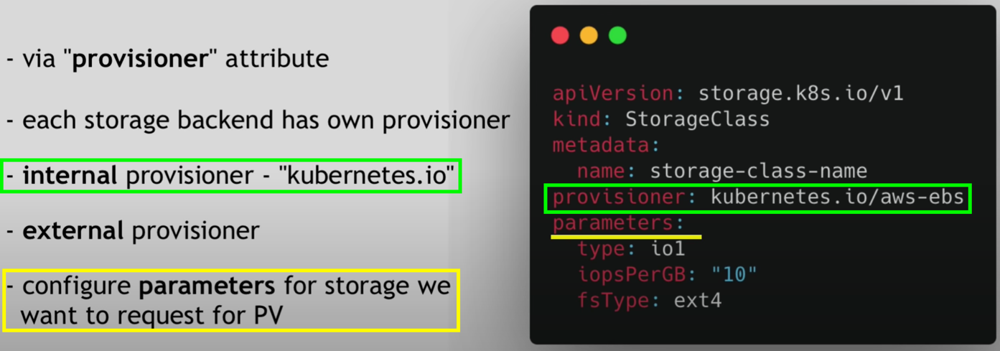
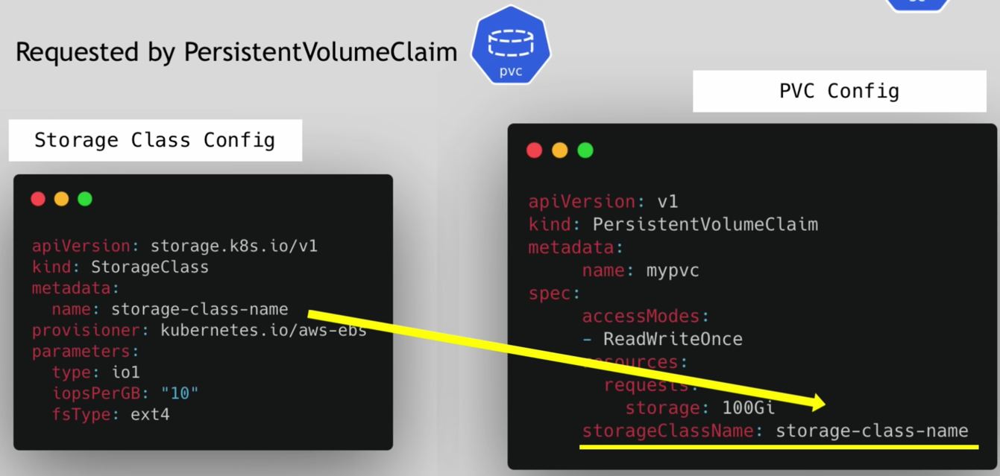

# Persistent data on K8s global idea

- `PersistentVolume (pv)` - K8s resource representation of an external persistent volume 
- `PersistentVolumneClaim (pvc)` - K8s resource representation of a claim to a `pv`. This `pvc` then can be used in
`Deployment`
- `StorageClass (sc)` - Dynamic creation of `pv` and these `pv` depends on the provisioner (AKS, GKE, EKS, OVH)

- The mandatory practices are the following

# Persistent volume

- The actual physical storage can be on
  - Kubernetes local storage on nodes `HostPath` (BAD PRACTICE)
  - Other object storage S3, DBs, etc...
  - Or NFS

- `pv` is only an interface plugin for working with your storages
  - Examples

| NFS                     | GCE Disk                | K8s node itself         |
|-------------------------|-------------------------|-------------------------|
|  |  |  |

- `pv` are not namespace

# Persistent volume claim

- The persistent volume needs to be claimed

- This is done by defining the `PersistentVolumeClaim` and by adding `spec.volumns.persistentVolumeClaim` on the resource
using the volume
  - The volume is available on the Pod level
  - Then on the Pod level you mount it on your container
  - `ReadWriteOnce` means "node-safe" access but between multiple pods in the same nodes they can access in parallel
    - See all here [Access Modes](https://kubernetes.io/docs/concepts/storage/persistent-volumes/#access-modes)

- `pvc` other info
  - `pvc` are namespaced
  - Multiple claim of different `PersistentVolumeClaim` is possible
  - And on the containers / pods you can choose which entities have which volume

- For application like `Prometheus` which needs access to `ConfigMap` or `Secret` files. It's done directly via K8s
local volumes

| Schema                  | YAML                    |
|-------------------------|-------------------------|
|  |  |

# Storage class

- K8s resource to make easier the creation of `pv` and `pvc`
  - Provisioner needs to be defined (the automatic provider of volumes)

- It creates dynamically the `pv` when a `pvc` is deployed

