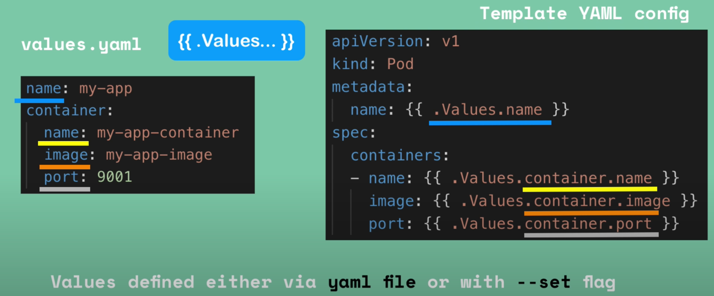
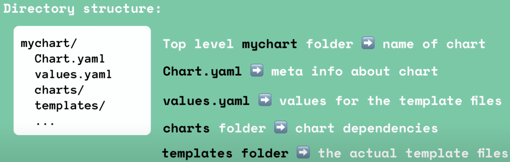
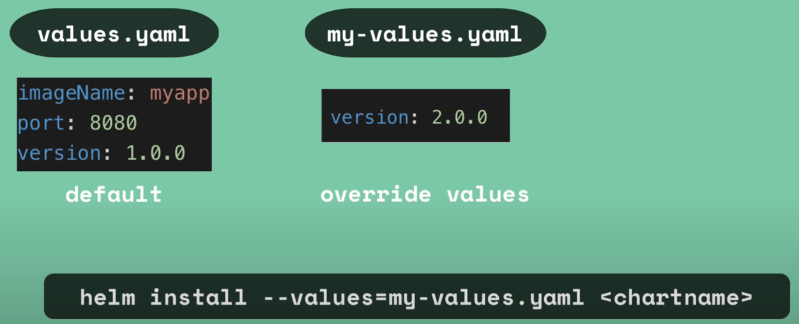
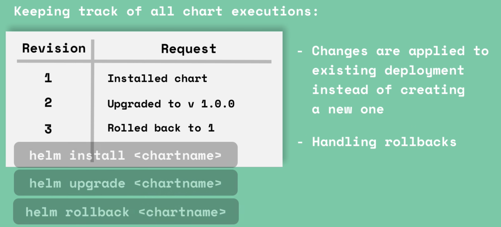

# Package manager & Helm charts

- Helm is a package manager for Kubernetes (ex: Helm == Maven repository && codes == YAML files)
- Helm public repository is [Artifact Hub](https://artifacthub.io/)

| Packaging YAML files (≈ codes to Maven repository) | Helm chart (≈ Library from Maven repository) |
|----------------------------------------------------|----------------------------------------------|
|                                 |                       |


# Templating Engine in Helm

- Templating in case for multiple similar microservices but differences are only on certain values
- Blueprint 👈 Containing the dynamic values
- YAML file with dynamic values templated




# Helm Chart Structure



- The following command will produce valid Kubernetes MANIFEST yaml files (deployable on Kuberentes)

```shell
helm install <chartname>
```


# Value injection into template files

- `values.yaml` contains the default values
- Default values can be overwritten during the installation in 2 ways
  - Apply our own `"my-values.yaml"` or setting it during the installation


```shell
helm install --set version=2.0.0
```



- Overall after the installation a `.Values object` will be generated


# Release Management (Tiller)

- In Helm version 2
  - Helm Client (Where you do your request `helm install <...>`)
  - Helm Server (Tiller)
    - Running on the Kubernetes Cluster
    - And update **chart execution history**
    - This **chart execution history** then can be re-used for rollbacks



- In Helm version 3 is removed because of security
