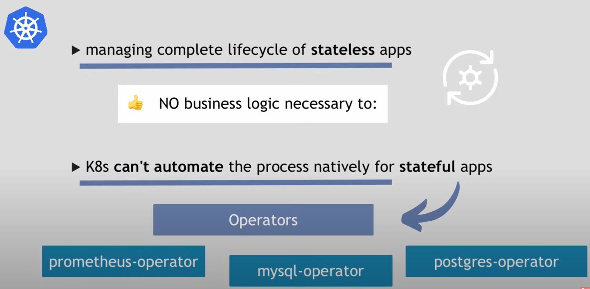
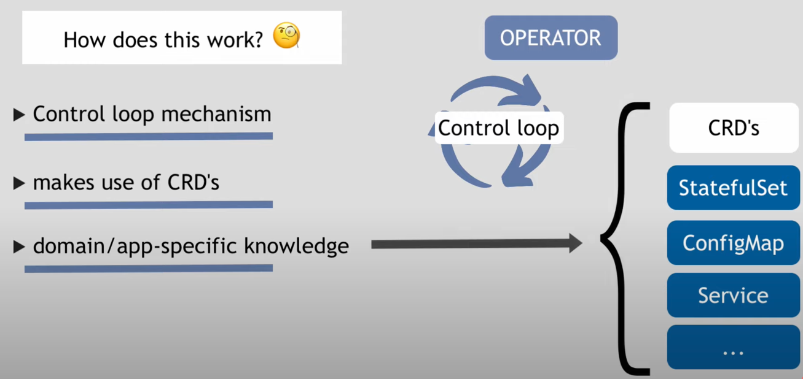
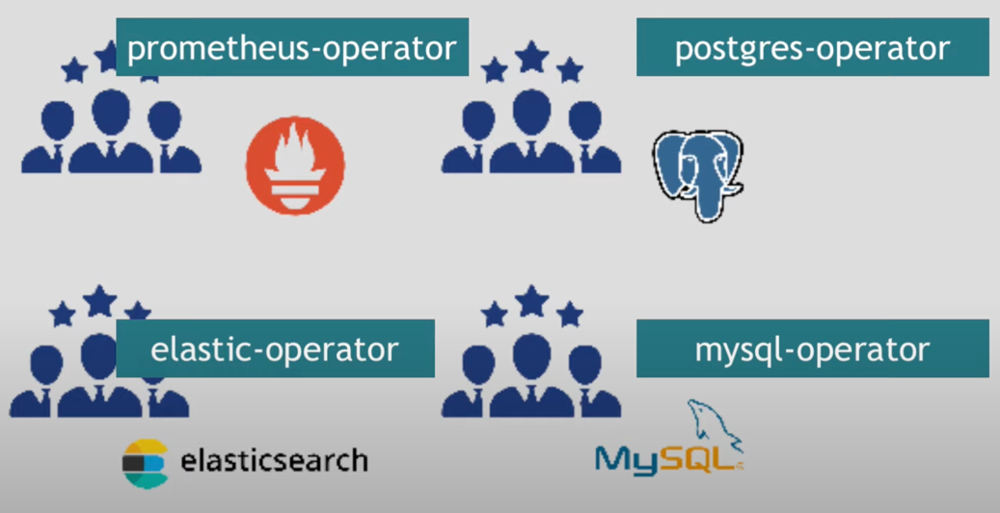

# Stateful applications with K8s operator

- The default **Control loop mechanism** is for Stateless application
- For Stateful application is needed **Custom control loop mechanism** because it depends on the technology used
  - ReplicaSet of DBs (Stateful) 👉 A replica failed what to do ?
  - Custom update 👉 if application running deployment changed (= configuration changed) what to do ?

- So we need `operators` to redefine the **loop** mechanism
- **CRD's** is a custom "kind"
  - For example, you can create `Deployment` & `Service` 👉 They are `Resources`
  - For the Spark operator it exists `ScheduledSparkApplication` AND `SparkApplication`
(link [here](https://operatorhub.io/operator/spark-gcp))

# Where are & Who manage the operators ?

- Operator are managed by the technology used contributors because they know the business logic
- Open source operators on [Operator Hub](https://operatorhub.io/)

