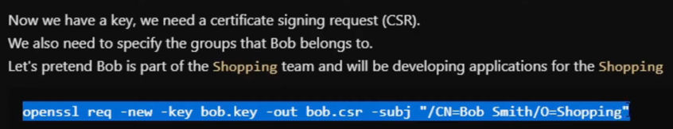

# RBAC base concepts

- Role based access control, it involves
  - `User` or `Service account`
    - the first is used for connection from external (actual user)
    - the second is used internally between pods
    - they both lived in a namespace level
  - `Role` & `RoleBinding`
    - the first is to define authorization at the namespace level
    - the second is to link a `Role` to a `User` or `Service account` at the namespace level
  - `ClusterRole` & `ClusterRoleBinding`
    - both idem but at a cluster level (between namespaces)

| `User` & `Service account` with some `Roles` | `RoleBinding`            |
|----------------------------------------------|--------------------------|
|                           |   |

# To properly add a new user on the cluster

- Create a certificate request `bob.csr` with `OpenSSL`

| Generate Key            | Generate Certificate    |
|-------------------------|-------------------------|
|  |  |

- Sign certificate request with Kubernetes CA files `ca.crt` & `ca.key` to have `bob.crt`
  - on the Master node `/etc/kubernetes/pki` folder
  - on the host PC for minikube `$HOME/.minikube`
  - Managed Kubernetes use OAuth instead (≈ No need all the steps above)

- `.kube/config` contains
  - Clusters 👉 with API & CAs
  - Users 👉 `.crt` token usable for authentication
  - Context 👉 binding Clusters to Users

| Abstract                | Actual                  |
|-------------------------|-------------------------|
|  |  |

- So we need to add these 3 things in our `.kube/config` to connect to the cluster

| Setup cluster             ||
|---------------------------|------------------------------|
|    |       |

| Setup user                ||
|---------------------------|------------------------------|
|    ||

| Setup context             ||
|---------------------------|------------------------------|
|  ||

- Switch the current context `kubectl config use-context dev`

# Roles & Roles binding

- Allowing `kubectl <verb>` to an external user or group

| Role to create            | Role binding to create    |
|---------------------------|---------------------------|
|  |  |

- Commands to apply these
  - `kubectl create ns shopping` (if the namespace is not existing yet)
  - `kubectl -n shopping apply -f <role.yaml>`
  - `kubectl -n shopping apply -f <rolebinding.yaml>`

# Service Account

- Internal inside Kubernetes "User"

- Then Pods can use this identity `ServiceAccount` to 

- If you check inside the Pod, you can exactly see the same idea of signed certificated we built for external user
  - So applications inside the pods can authenticate to the cluster

- For the `ServiceAccount` (≈ Our external user) we need to define `Role` & `RoleBinding`

| Role to create            | Role binding to create    |
|---------------------------|---------------------------|
|  |  |