# Core Concepts

**Pods**

- Application deployed using Pods
- A Pod contains one or more containers

**ReplicaSet**

- Pods replicas
  - Replicas are for achieving **availability** and **scalability**
  - Exact number of pods to maintain by the ReplicaSet
  - It means applications inside pods need to be stateless!
- Some other important sets are
  - **StatefulSet** => Scaling of a group of pods with volume persistence (for DBs)
  - **DaemonSet** => One Pod per Node (for Monitoring)

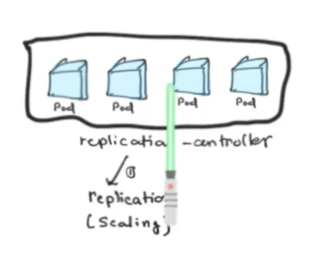

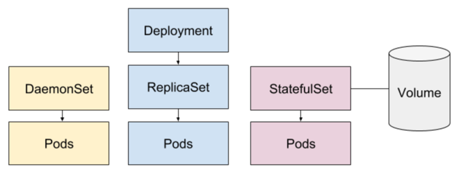

**Deployment**

- Deployment strategy
  - [Rolling update](https://kubernetes.io/docs/tutorials/kubernetes-basics/update/update-intro/) => For 0 downtime deployment
  - [Recreate](https://kubernetes.io/docs/concepts/workloads/controllers/deployment/) => All pods killed before creating

**Services**

- Network endpoint to pods
  - For **load-balancing** between pods the traffic
  - The **endpoint to target** to run something in the replicas
  - All details [here](https://medium.com/google-cloud/kubernetes-nodeport-vs-loadbalancer-vs-ingress-when-should-i-use-what-922f010849e0)

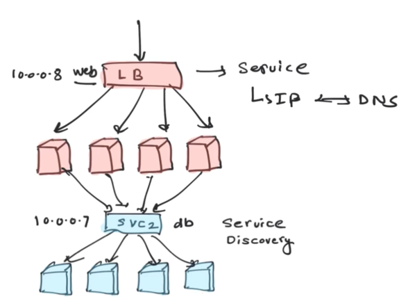

**Cluster**

- Cluster master directs Worker nodes (scheduling decisions, monitor Cluster)
- Cluster node runs Pods

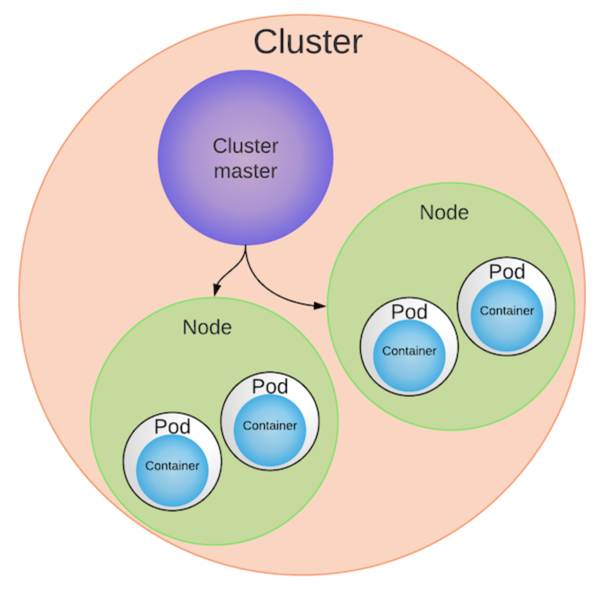

**Master**

- API Server => For `kubectl` commands
- etcd => Distributed in key-value for Cluster state
- Scheduler => Manage Pods on Nodes
- kube-controller-manager & cloud-controller-manager

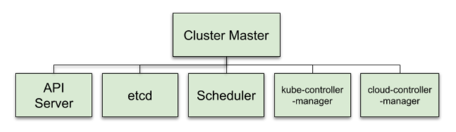

**Node**

- kubelet => Brain of the node (communication with Master)
- kube-proxy => Network Connections AND Load balancing across Pods
- Container Runtime => Download images AND Run them in containers

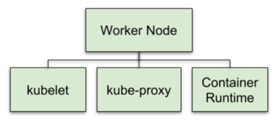

**Namespaces**

- Cluster partitions for example (DEV environment AND PROD environment)

# When running

**Whole kubernetes**

- Deployments create and manage ReplicaSets
- which create and manage Pods
- which run on Nodes
- which have a container runtime
- which run the app code you put in your Docker image

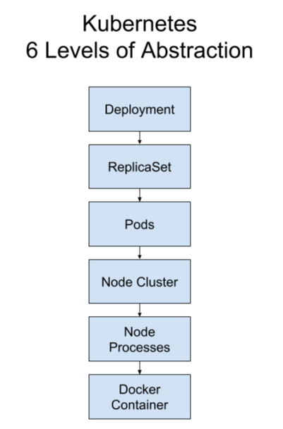

[Example of scenario](https://www.youtube.com/watch?v=PH-2FfFD2PU)

# Services in details

- [Kubernetes Services explained](https://www.youtube.com/watch?v=T4Z7visMM4E)

- ClusterIP => Service only available in-within the cluster

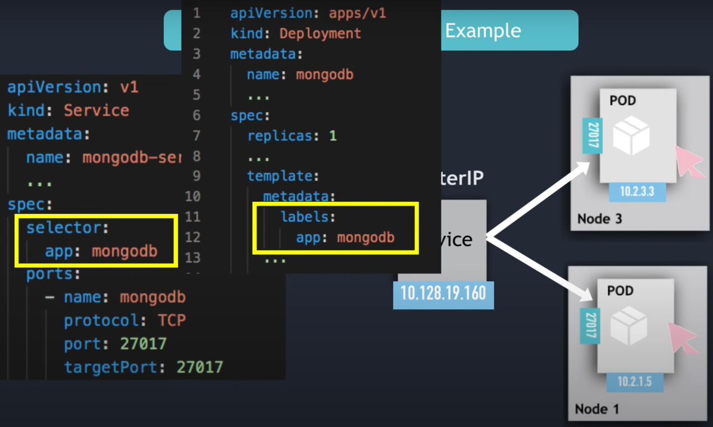

- An example of multi-ports service

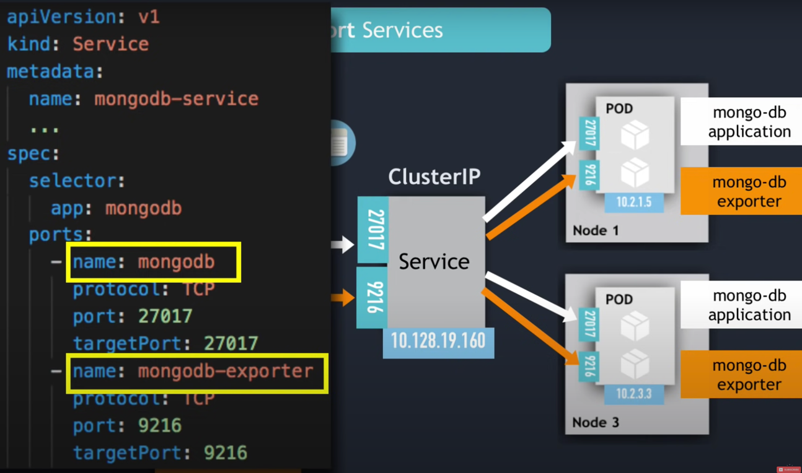

- Headless service => ClusterIP to None and you can directly talk to each pods with Pods DNS
- NodePort => It's port directly opened to cluster outside on each Node and target pods
  - Do not use for prod

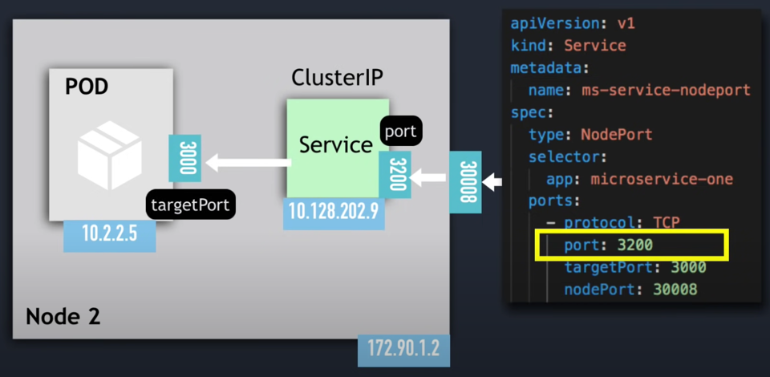

- LoadBalancer => A single address for all forwarding external traffic to your service
  - Used for prod
  - Only if Cloud provider available
  - Alternative can be Ingress

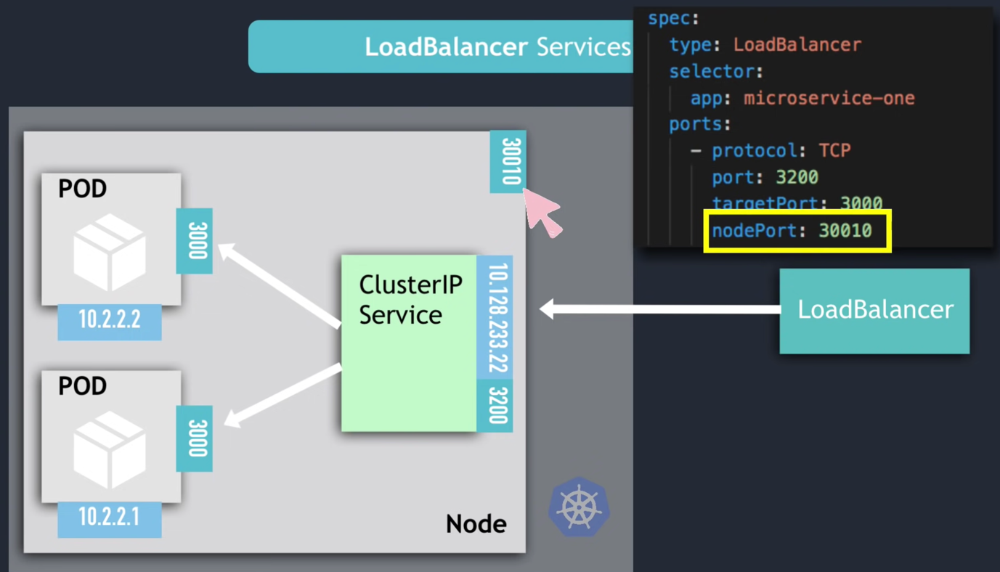

